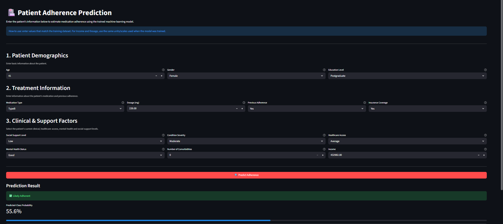

# 🏥 Patient Adherence Prediction using Machine Learning




A supervised machine learning project that predicts whether a patient is likely to **adhere (1)** or **not adhere (0)** to their prescribed medication — helping healthcare providers flag at-risk patients early and intervene before outcomes worsen.

🔗 **Repo:** [AlaSushanth/Patient-Adherence-Prediction](https://github.com/AlaSushanth/Patient-Adherence-Prediction)

---

## 📌 Overview

Medication non-adherence drives disease progression, hospital readmissions, and avoidable healthcare costs. This project builds an end-to-end ML pipeline that predicts a patient's adherence status from demographic, medical, and socioeconomic attributes, and deploys the trained pipeline as an interactive **Streamlit** app.

`EDA → Preprocessing → Model Selection (2 tracks) → Hyperparameter Tuning → Evaluation → SHAP Explainability → Deployment`

---

## 🎯 Problem Statement

Binary classification: predict `Adherence` (1 = Adherent, 0 = Non-Adherent) from a patient's demographic, clinical, and socioeconomic attributes.

**Dataset:** 5,000 patient records, 13 features, no missing values, target reasonably balanced — **2,714 non-adherent (54.3%)** vs **2,286 adherent (45.7%)**.

---

## 🗂️ Dataset Features

| Category | Features |
|---|---|
| Demographic | Age, Gender, Education Level |
| Clinical | Medication Type, Dosage (mg), Condition Severity, Comorbidities Count, Previous Adherence |
| Psychosocial | Mental Health Status, Social Support Level |
| Socioeconomic | Income, Healthcare Access, Insurance Coverage |

---

## 🔬 Machine Learning Pipeline

### 1. Exploratory Data Analysis (EDA)
- Class balance check (`value_counts`) — target is reasonably balanced, not heavily skewed
- Distribution analysis: count plots (Adherence vs Gender, Previous Adherence), box plot (Income vs Adherence)
- Correlation heatmap across numerical features
- Skewness check on numeric columns (`Comorbidities_Count` and `Insurance_Coverage` showed the most skew)
- Missing value check — **zero missing values** across all 5,000 rows

### 2. Preprocessing — two separate pipelines were built

**Pipeline A** (used with Logistic Regression / SVM):
- Custom IQR-based **Outlier Capper** (clips values outside `Q1 - 1.5×IQR` to `Q3 + 1.5×IQR`) — applied to `Income`
- `PowerTransformer` (Yeo-Johnson) — applied to `Income` after capping, to correct skew
- `StandardScaler` — applied to `Income`
- `OrdinalEncoder` for ordered categoricals: `Education_Level`, `Social_Support_Level`, `Condition_Severity`, `Healthcare_Access`, `Mental_Health_Status` (each with an explicit category order, e.g. `Mild → Moderate → Severe`)
- `OneHotEncoder` for nominal categoricals: `Gender`, `Medication_Type`
- Remaining numeric columns passed through unchanged

**Pipeline B** (used with tree-based / boosting models):
- Same `OrdinalEncoder` + `OneHotEncoder` as above
- **No outlier capping, power transform, or scaling** — tree-based models don't require feature scaling, so this step was intentionally skipped for that track

Both built with `ColumnTransformer` + `Pipeline` so preprocessing and model train/predict together as one object.

### 3. Model Selection — two parallel searches

| Search | Models compared | Tuning method | Scoring |
|---|---|---|---|
| `grid1` | Logistic Regression, SVM (RBF) | `GridSearchCV`, 5-fold | `roc_auc` |
| `grid2` | Decision Tree, Random Forest, Gradient Boosting, **XGBoost** | `RandomizedSearchCV`, 5-fold | `roc_auc` |

> Both searches optimized **ROC-AUC**, not accuracy — a more reliable choice than raw accuracy for this kind of classification problem.

---

## 🏆 Best Performing Model

**XGBoost Classifier** — selected as `grid2.best_estimator_`, with the strongest cross-validated ROC-AUC among Decision Tree, Random Forest, Gradient Boosting, and XGBoost.

Best hyperparameters found:
```
n_estimators=200, max_depth=3, learning_rate=0.01,
subsample=1.0, colsample_bytree=1.0, min_child_weight=1,
gamma=0.3, reg_alpha=0.1, reg_lambda=10
```

(For comparison, the best of the linear/SVM track was **Logistic Regression** with `C=1, penalty='l1', solver='liblinear'`, CV ROC-AUC ≈ 0.681 — nearly identical to XGBoost's CV score of ≈ 0.680, so the boosting model's edge came mainly from better performance on the held-out test set.)

---

## 📊 Model Evaluation (on test set, 1,500 samples)

| Metric | Value |
|---|---|
| Accuracy | 0.65 |
| ROC-AUC | 0.695 |
| Precision (class 0 – Non-Adherent) | 0.68 |
| Recall (class 0 – Non-Adherent) | 0.67 |
| Precision (class 1 – Adherent) | 0.62 |
| Recall (class 1 – Adherent) | 0.63 |

Also evaluated with a Confusion Matrix and ROC Curve.

### Precision-Recall Curve (Non-Adherent class)


Plotted with `pos_label=0` (non-adherent as the positive class), since correctly catching at-risk patients is the priority. Precision starts high at low recall and declines as the threshold is lowered to catch more at-risk patients — the core tradeoff behind the threshold-selection decision for this model.

---

## 🧠 Model Explainability (SHAP)

Explainability was performed with `shap.TreeExplainer` on the final XGBoost model:

- **SHAP Summary Plot** — global view of how each feature pushes predictions up/down across all test patients
- **SHAP Bar Plot** — mean absolute SHAP value per feature (global feature importance)
- **SHAP Waterfall Plot** — local explanation for a single patient's prediction

Feature importance was also extracted directly from the model's `.feature_importances_`.

---

## 🚀 Deployment

The trained pipeline (preprocessing + XGBoost model) was serialized with **Pickle** and deployed as an interactive **Streamlit** app.

The app allows a user to:
- Enter patient information through a form
- Get an instant adherence prediction
- View the underlying prediction probability
- Interact through a simple healthcare-friendly UI

### Run it locally
```bash
git clone https://github.com/AlaSushanth/Patient-Adherence-Prediction.git
cd Patient-Adherence-Prediction
pip install -r Requirements.txt
streamlit run app.py
```

---

## 🛠️ Technologies Used

**Language:** Python

**Libraries:** NumPy · Pandas · Seaborn · Matplotlib · Scikit-learn · XGBoost · SHAP · Streamlit

**Environment:** Google Colab

---

## 📁 Repository Structure

```
Patient-Adherence-Prediction/
│
├── images/                          # App screenshots & evaluation plots
├── app.py                           # Streamlit application
├── train_model.ipynb                # Model training & evaluation notebook
├── patient_Adherence_prediction.pkl # Serialized preprocessing + model pipeline
├── patient_adherence_dataset.csv    # Dataset
├── Requirements.txt                 # Project dependencies
└── README.md
```

---

## 🔮 Future Improvements

- [ ] Probability calibration (Platt scaling / isotonic regression)
- [ ] Model monitoring & drift detection in production
- [ ] Try scaling + power transform on more features for the boosting track too
- [ ] Interactive explainability dashboard
- [ ] Cloud deployment
- [ ] Automated retraining pipeline

---

## 🎓 Key Learning Outcomes

- End-to-end supervised ML workflow with two parallel model-search tracks
- Custom `TransformerMixin`-based outlier capping inside a Scikit-learn `Pipeline`
- Ordinal vs one-hot encoding strategy based on whether a categorical feature has a natural order
- Hyperparameter tuning with `GridSearchCV` and `RandomizedSearchCV`, optimizing ROC-AUC
- Model evaluation beyond accuracy: ROC-AUC, confusion matrix, precision-recall curve
- Model explainability using SHAP for clinical stakeholder communication
- Deployment of a serialized Scikit-learn pipeline via Streamlit

---

## 📬 Author

**Ala Sushanth**
GitHub: [@AlaSushanth](https://github.com/AlaSushanth)
